# spring-gumball CI/CD Lab Notes

## Part 1: CI
First, I cloned over the repo and set up the CI action on Github. 

I had to update the file as my Github account hasn't updated master to main yet

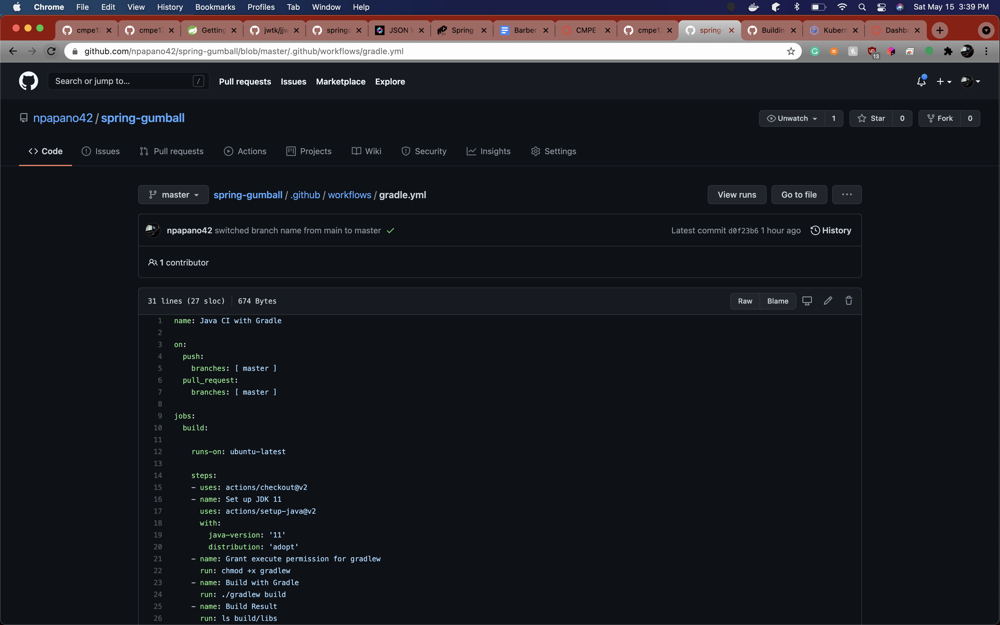 

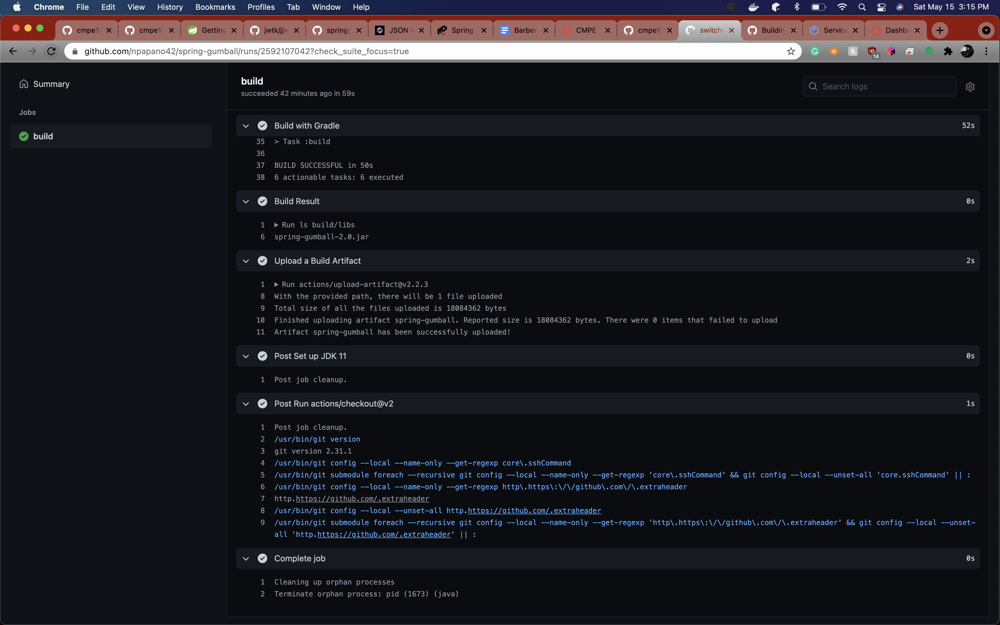

## Part 2: CD

Then, I moved over and set up the service account on GKE with the key

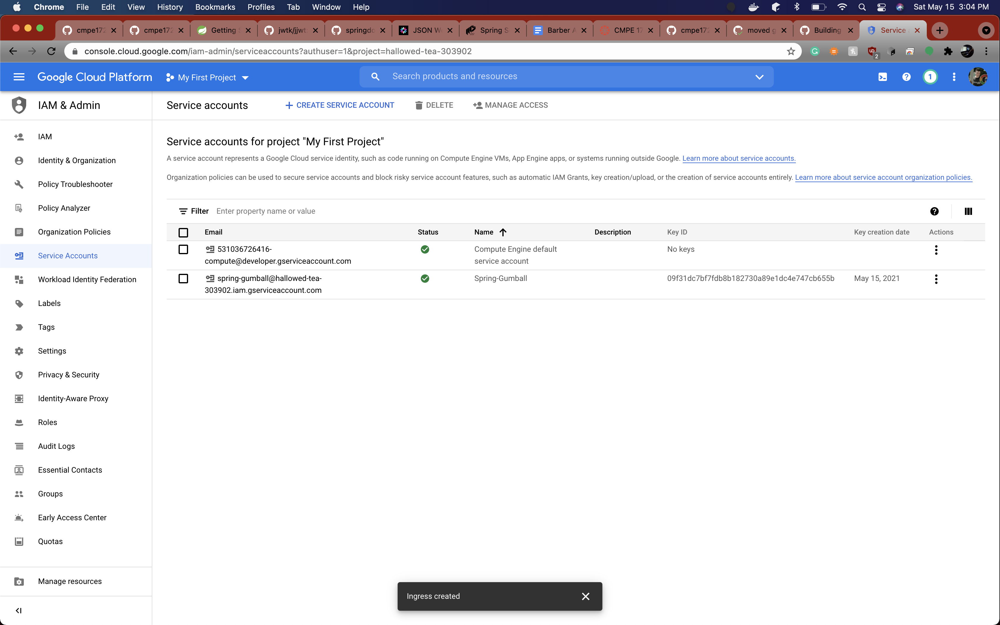

I set up a cluster and updated my yaml file

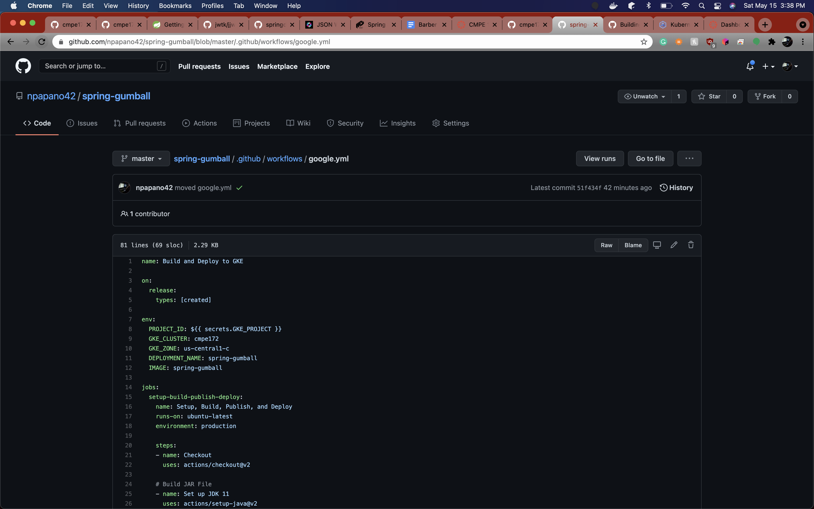

And migrated that over to my github. I forgot to base64 encode the key and for some reason the github action didn't put the yml file in the right location at first, so it took a couple tries to get that up

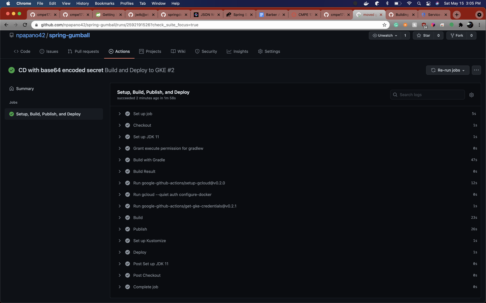

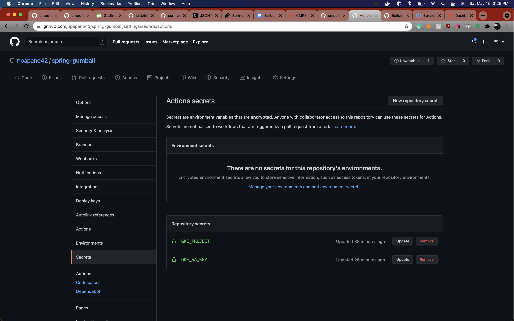

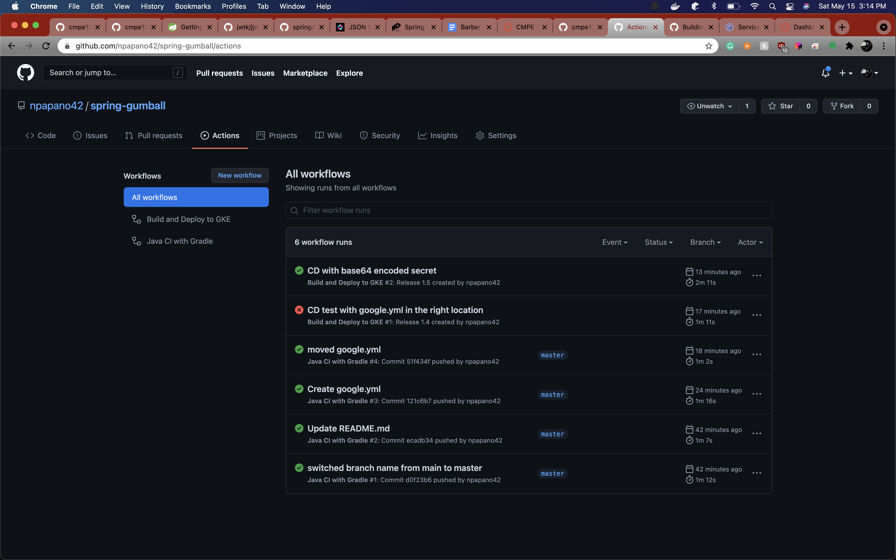

From there, I checked on GKE to confirm it worked, which it did.

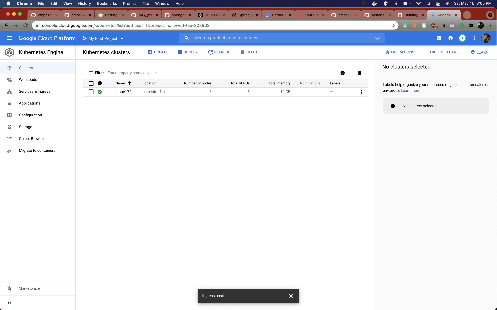

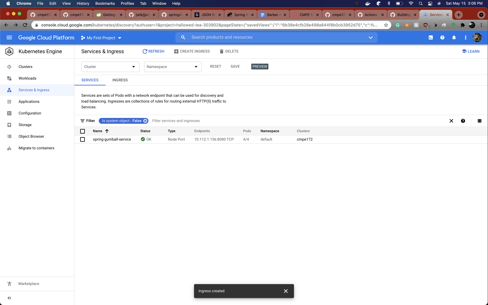

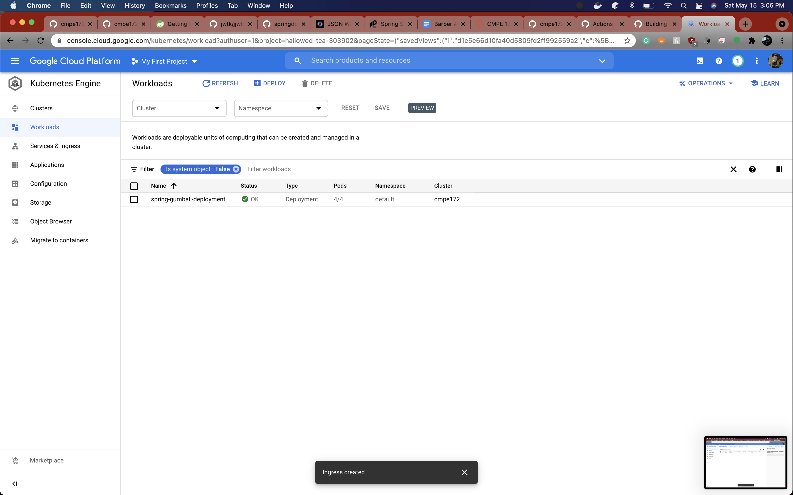

So I created a load balancer...

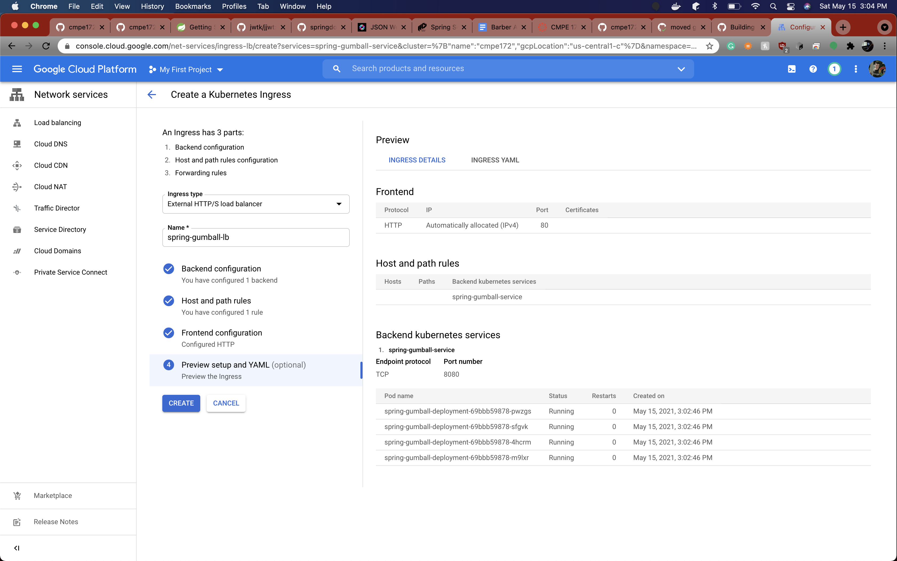

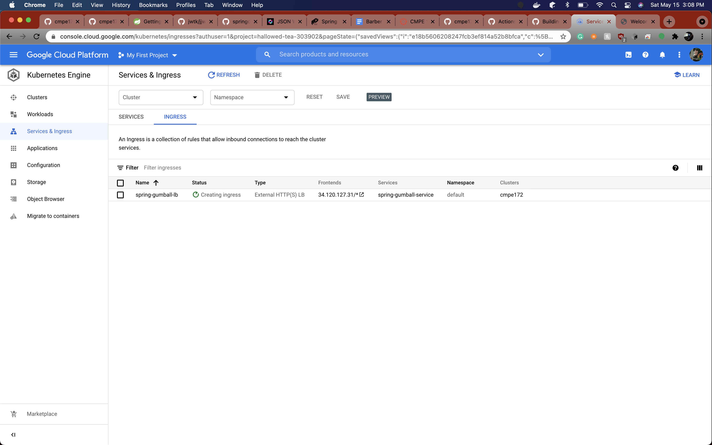

And hit the endpoint successfully!

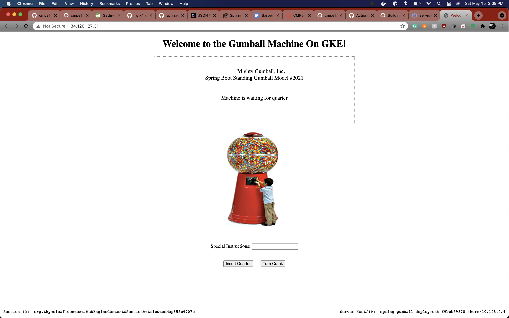

Lab complete!
